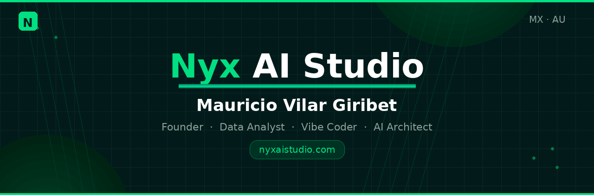

<!-- Banner centrado -->

  

---

### Hi there 👋, I'm Mau

🇲🇽 Mexico · 🇦🇺 Australia  
🚀 Founder @ **[Nyx AI Studio](https://nyxaistudio.com)** · 📊 Data Analyst · 💻 Vibe Coder · 🤖 AI Architect

---

### About me

- 🚀 **Founder of [Nyx AI Studio](https://nyxaistudio.com)** — a digital solutions studio specializing in AI-powered web development, automation, and white-label SaaS.
- 🧠 I analyze, clean, and model data using **Python/SQL** to uncover patterns and support decision making.
- 🧹 Strong focus on **data cleaning**, exploratory analysis, and building dashboards.
- 💻 **Vibe Coder Developer** — building full-stack products and automations with AI-assisted workflows.
- 🏆 **Claude Power User** — mastering AI-driven development, prompt engineering, and agentic workflows at scale.
- 🛠️ Tools I use: **Python, SQL, Pandas, Power BI, Tableau, Databricks, Supabase, Claude, n8n, Cursor**.
- 🤖 Passionate about **AI agents, automation, and shipping fast** with modern tooling.
- 📫 How to reach me: **unicemau@gmail.com** · **[nyxaistudio.com](https://nyxaistudio.com)**

---

### Tech & Tools

